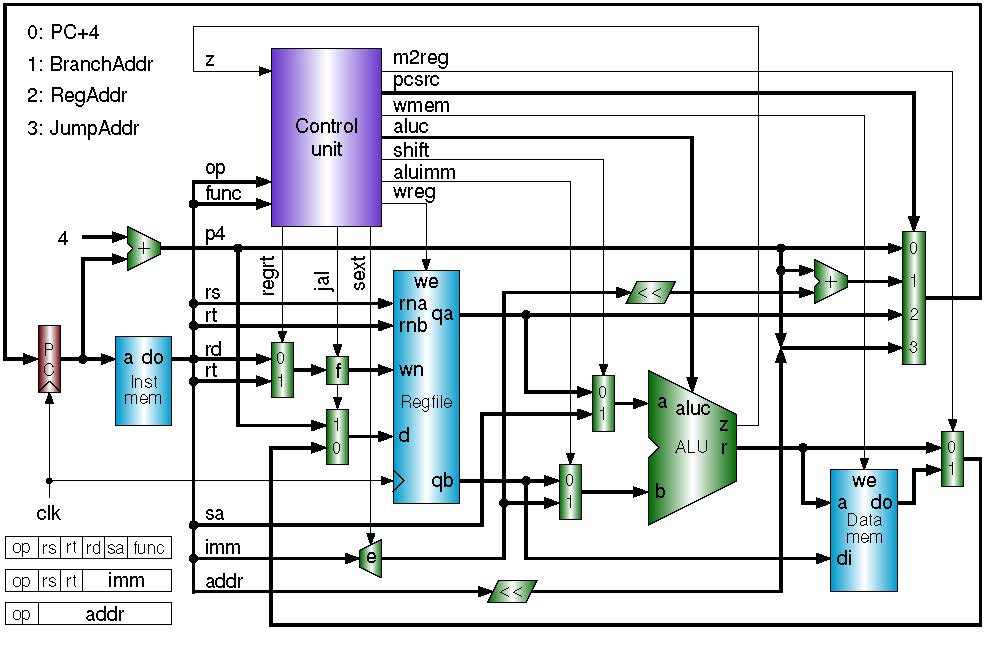

# 🚀 RISC-V Single-Cycle CPU (Verilog Implementation)


---

## 📝 Table of Contents

- [About the Project](#about-the-project)
- [Core Features](#core-features)
- [CPU Architecture](#cpu-architecture)
- [File Structure](#file-structure)
- [Quick Start](#quick-start)
- [Writing and Loading Programs](#writing-and-loading-programs)
- [Debugging & Simulation Tips](#debugging--simulation-tips)
- [Sample Program](#sample-program)
- [Useful Tools & Resources](#useful-tools--resources)
- [License](#license)

---

## 🌟 About the Project

This project is a **minimal yet functional RISC-V single-cycle CPU** written in Verilog.
It is designed for educational use, rapid prototyping, and easy simulation.
You can run your own RISC-V assembly programs by converting them to machine code and loading them into the on-chip instruction memory.

**Supported RISC-V types:**

- R-type (arithmetic)
- I-type (immediate & load)
- S-type (store)
- B-type (branch)

---

## 🔥 Core Features

- Implements essential RV32I instructions
- Modular Verilog design—easy to modify or expand
- **Register file, ALU, instruction/data memory, control unit, sign extender, program counter, and branch logic**
- Memory-mapped RAM for loads and stores
- Simple to debug with waveform tools (ModelSim, Vivado, GTKWave, etc.)
- Plug-and-play with your own programs

---

## 🏛️ CPU Architecture

<details>
<summary>Click to expand Block Diagram (Mermaid)</summary>

</details>

---

## 📁 File Structure

```

.
├── alu.v # Arithmetic logic unit
├── register_file.v # 32x32 register file
├── instruction_memory.v # ROM/IMEM (editable program)
├── data_memory.v # RAM/DMEM
├── control_unit.v # Decodes instructions
├── sign_extender.v # For I/S/B-types
├── top.v # CPU top-level module
├── tb.v # Testbench
└── README.md

```

---

## 🚦 Quick Start

### 1. **Set Up Your Instruction Memory**

Edit `instruction_memory.v`:

```verilog
initial begin
    memory[0] = 32'h00a00093;   // addi x1, x0, 10
    memory[1] = 32'h00000113;   // addi x2, x0, 0
    memory[2] = 32'h00112023;   // sw x1, 0(x2)
    memory[3] = 32'h00312103;   // lw x3, 0(x2)
    memory[4] = 32'h00518193;   // addi x3, x3, 5
    memory[5] = 32'h003202b3;   // add x5, x4, x3
    memory[6] = 32'h00000063;   // beq x0, x0, PC (halt)
end
```

Use [Venus](https://venus.cs61c.org/) or [Ripes](https://ripes.app/) to convert RISC-V assembly to hex.

---

### 2. **Simulate**

Use your favorite simulator (e.g., Icarus Verilog, ModelSim, Vivado):

```sh
iverilog -o cpu_tb top.v tb.v alu.v register_file.v instruction_memory.v data_memory.v control_unit.v sign_extender.v
vvp cpu_tb
```

View `cpu.vcd` in [GTKWave](http://gtkwave.sourceforge.net/) or any waveform viewer.

---

### 3. **Analyze Waveforms**

Key signals:

- `pc`: program counter
- `Instr`: current instruction
- `srcA`, `srcB`: register/ALU inputs
- `ALUresult`: ALU output
- `memwrite`: RAM write enable
- `RegWrite`: register file write enable
- `MRD`: memory read data
- `Result`: value written to register file

---

## 💾 Writing and Loading Programs

1. Write your RISC-V assembly (use only supported instructions!).
2. Use [Venus](https://venus.cs61c.org/) or [Ripes](https://ripes.app/) to assemble it to hex.
3. Place the hex codes in `instruction_memory.v`.

---

## 🐞 Debugging & Simulation Tips

- **Watch your `pc` and `Instr`!** Make sure the PC increments by 4 and new instructions are fetched.
- **Check `srcA`/`srcB`** for register values.
- **Look for `memwrite` pulses** to confirm stores.
- **`MRD` shows data loaded from RAM.**
- Use `$monitor` or `$display` in your testbench for live debug info.

---

## 📚 Sample Program

A program that stores and loads, then does arithmetic:

```assembly
addi x1, x0, 10     # x1 = 10
addi x2, x0, 0      # x2 = 0 (RAM base address)
sw   x1, 0(x2)      # RAM[0] = 10
lw   x3, 0(x2)      # x3 = RAM[0]
addi x3, x3, 5      # x3 = x3 + 5
add  x5, x4, x3     # x5 = x4 + x3 (if x4==0, x5=15)
beq  x0, x0, .      # Infinite loop (halt)
```

---

## 🛠️ Useful Tools & Resources

- [Venus Online Assembler/Emulator](https://venus.cs61c.org/)
- [Ripes RISC-V Simulator](https://ripes.app/)
- [rvcodecjs Hex Tool](https://luplab.gitlab.io/rvcodecjs/)
- [RISC-V Green Card (ISA Reference)](https://inst.eecs.berkeley.edu/~cs61c/fa20/projects/proj2/rv64im-green-card.pdf)

---

## 📜 License

MIT License

---

### ✨ _Enjoy exploring computer architecture with your own RISC-V CPU!_

---
